# Comandos básicos en local.

[Readme Principal](/README.md) <br>
[Readme T1.1](../README.md)

## Escribe los comandos según su descripción:

1. Transforma el directorio actual en un repositorio de Git. Se añade un subdirectorio de .git con todos los archivos necesarios del repositorio

    ```bash
    git init
    ls -la
    ```
    
    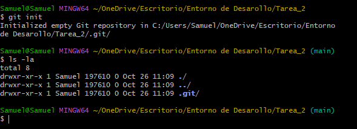

2. Especifica qué archivos quieres añadir al repositorio (a staging area, staged). Prepara los archivos modificados

    ```bash
    git add <archivo>
    ```
    
    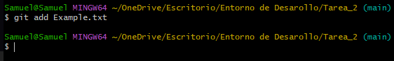
 
3. Confirma los cambios (a directorio git, committed)

    ```bash
    git commit -m "mensaje del commit"
    ```
    
    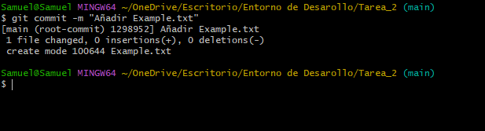
    
4. Clona un repositorio existente

    ```bash
    git clone <url>
    ```
    
    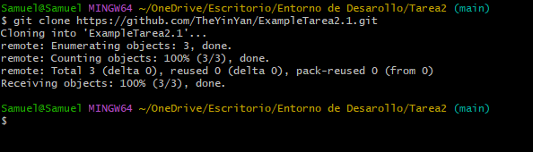
 
5. Muestra el estado de los archivos

    ```bash
    git status
    ```
    
    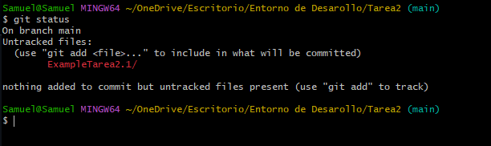
 
6. Muestra estado abreviado

    ```bash
    git status -s
    ```
    
    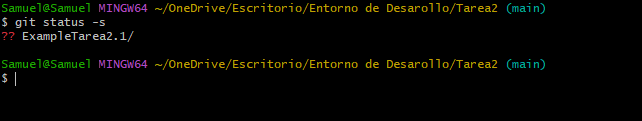
 
7. Ignora archivos

    ```bash
    nano .gitignore
    ```
    
    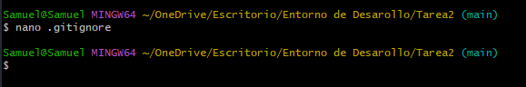
    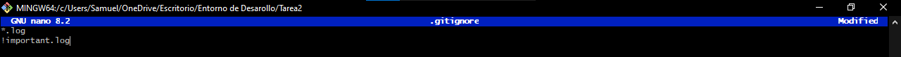

 
8. Mostrar los cambios: líneas exactas que fueron añadidas y eliminadas. Compara lo que tienes en tu directorio de trabajo con lo que está en el área de preparación

    ```bash
    git diff    
    git diff --staged
    git diff --cached
    ```
    
    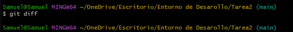
    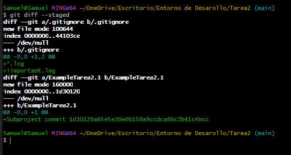
    


9. Mostrar los cambios: líneas exactas que fueron añadidas y eliminadas. Compara tus cambios preparados con la última instantánea confirmada

    ```bash
    git commit -a -m "mensaje del commit"
    ```
    
    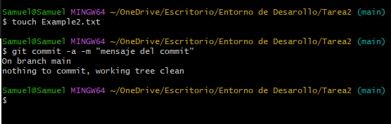
 
10. Confirma los cambios sin pasar por el área de preparación (a directorio git, committed)

    ```bash
    git commit -a -m "mensaje del commit"
    ```
    
    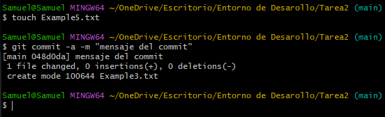
 
11. Eliminar archivos del directorio de trabajo y del área de preparación

    ```bash
    git rm -f <archivo>
    ```
    
    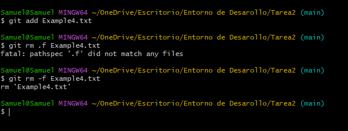
 
12. Renombrar archivos del directorio de trabajo y del área de preparación

    ```bash
    git mv <archivo_antiguo> <archivo_nuevo>
    ```
    
    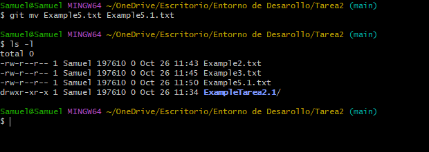

13. Muestra el historial de confirmaciones

    ```bash
    git log
    ```
    
    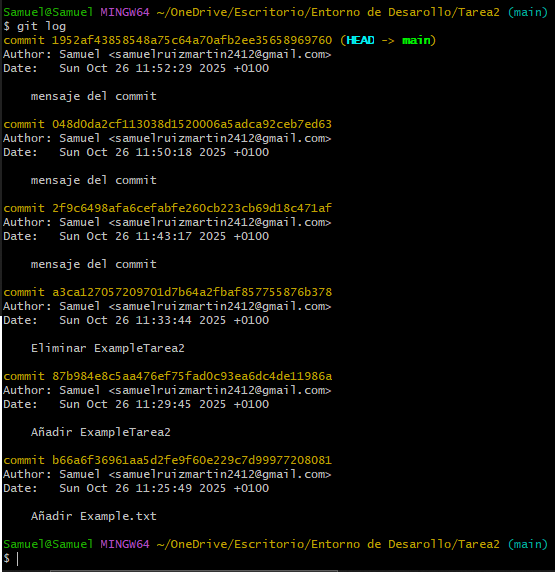
 
14. Muestra sólo las dos últimas confirmaciones indicando las diferencias introducidas en cada confirmación 

    ```bash
    git log -p -2
    ```
    
    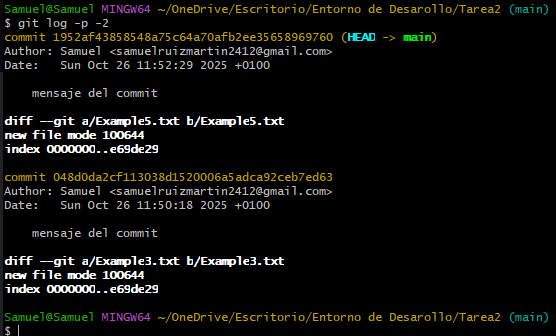
 
15. Rectifica el último commit ***(Para salir Guradando cambios ESC + :wq y sin guardar cambio ESC + :w)***

    ```bash
    git commit --amend
    ```
    
    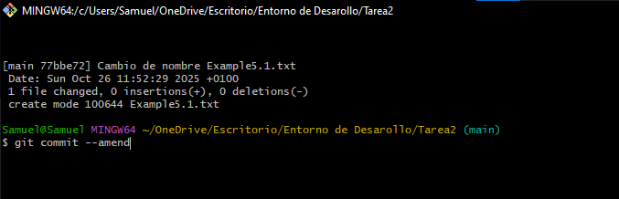
    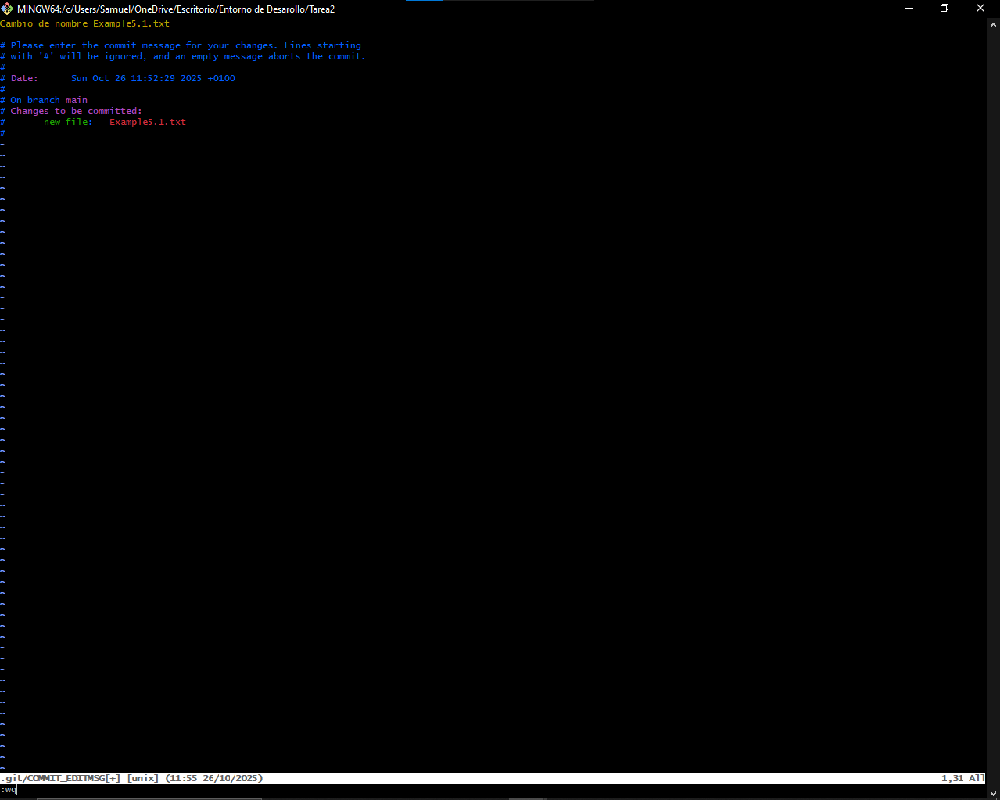


[Readme Principal](/README.md) <br>
[Readme T1.1](../README.md)