# Generación de un conflicto en git y fichero .gitignore

[Readme Principal](../../Readme.md) <br>
[Readme T1.1](../README.md)

## Primera parte

1.  Crea un repositorio local (distinto del repo de la unidad) y avanza en la rama _main_ (renombra si es necesario la rama) añadiendo un fichero _index.html_ con la estructura básica html. El body estará vacío.

    Crear repositorio inicial y iniciarlo

    ```bash
    git init
    ```

    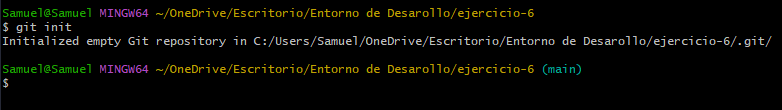

    Añadir fichero index, estructura basica y body vacio

    ```bash
    nano index.html
    cat index.html
    ```

    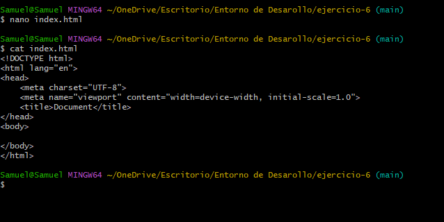

    Y añadimos y comentamos

    ```bash
    git add .
    git commit -m "Añadimos el index.html en main"
    git log
    ```

    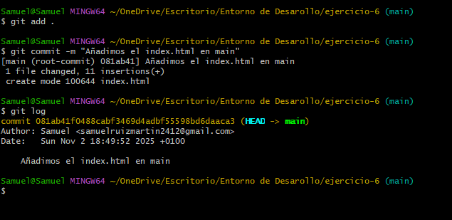

2.  Crea y salta a `rama-1`. Avanza en un commit con tu nombre de pila en un párrafo dentro del body

    Creacion de la rama-1 y empezmos en ella

    ```bash
     git checkout -b rama-1
    ```

    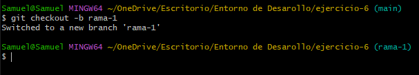

    Añadir nombre de pila index.html

    ```bash
     nano index.html
     cat index.html
    ```

    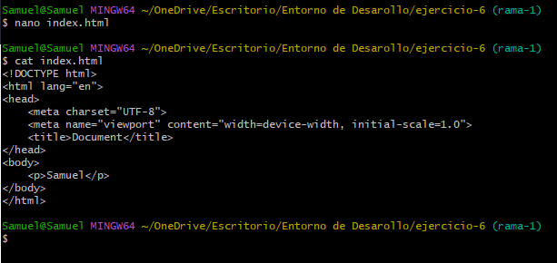

    Y añadimos y comentamos

    ```bash
     git add .
     git commit -m "Añadimos nombre de pila en el index.html en rama-1"
     git log
    ```

    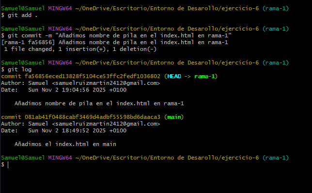

3.  Vuelve a la rama main.

    ```bash
    git checkout main
    ```

    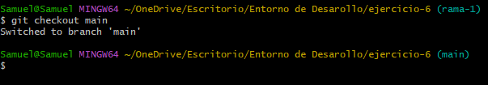

4.  Crea y salta a `rama-2`. Avanza en un commit con tu apellido en un párrafo dentro del body

    Creacion de la rama-2 y empezmos en ella

    ```bash
    git checkout -b rama-2
    ```

    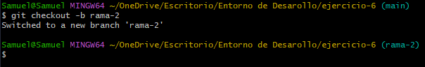

    Añadir apellidos index.html

    ```bash
     nano index.html
     cat index.html
    ```

    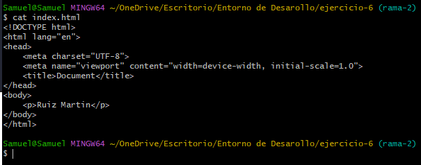

    Y añadimos y comentamos

    ```bash
    git commit -am "Añadimos apellidos en el index.html en rama-2"
    git log
    ```

    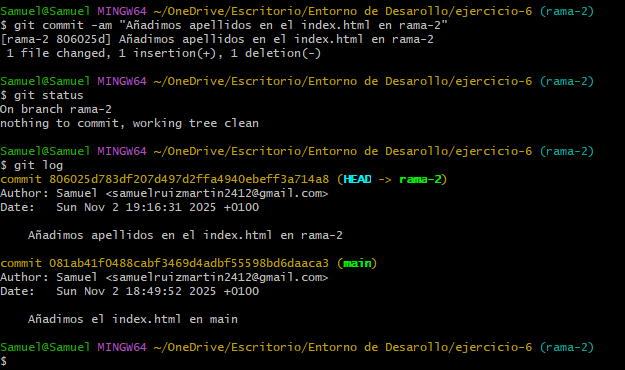

5. Muestra el estado del repositorio de forma gráfica y resumida

    ```bash
    git log --oneline --graph --decorate --all
    ```
    
    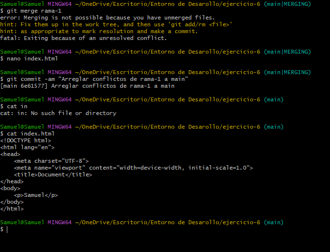


6. Haz un merge a rama-1. Intentas fusionar ambas ramas. Aparecerá un conflicto porque ambos commits trabajan en la misma porción `<body></body>` de un mismo archivo _index.html_. Git no será capaz de fusionarlas directamente

    Si te pasa veces no da conflicto y es por la configuración por defecto de git, investiga si es tu caso y desactiva lo necesario.
    
    Desactiva configuraciones que evitan conflictos:

    ```bash
    git config --global rerere.enabled false
    git config --global pull.rebase false
    git config --global merge.conflictstyle merge
    ```

    Luego vuelve a intentar:

    ```bash
    git merge --no-ff rama-2
    git merge rama-1
    ``` 

    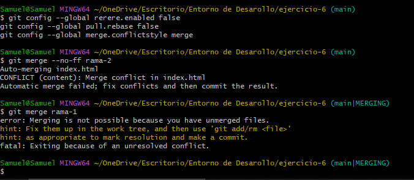

7. Muestra una captura de pantalla del estado del fichero "conflictivo" describiendo sus partes.

    Modificando el fichero en el conflicto:

    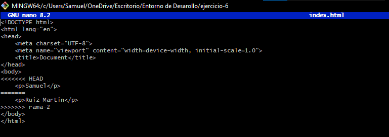
    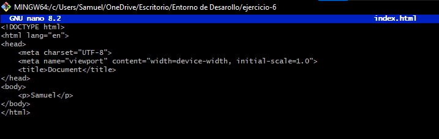

8. Una vez que se ha resuelto el conflicto confirma el archivo en conflicto para que pueda realizar esos cambios

    Arreglar el conficto:
    ```bash
    nano index.html
    git commit -am "Arreglar conflictos de rama-1 a main"
    ```

    


9.  Una vez que se ha resuelto el conflicto confirma el archivo en conflicto para que pueda realizar esos cambios

    ```bash
    git log --oneline --graph --decorate --all
    ```

    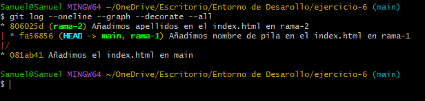

10. Vuelve a la rama main y realiza otro merge. Es una fusión fast-forward. Los dos commits a fusionar tienen relación de ancestro. Entonces el merge no produce un commit nuevo, sencillamente avanza la rama, "avance rápido"

    ```bash
    git merche rama-2
    git nano index.html
    git commit -am "Añadir rama-2 a main"
    ```
    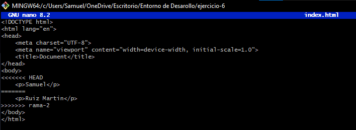
    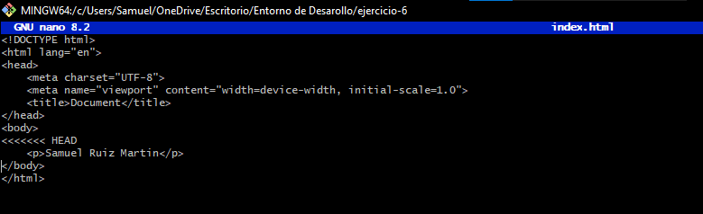
    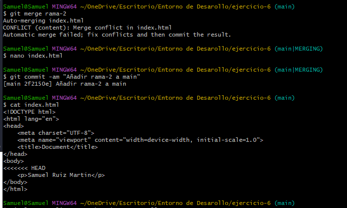


11. Visualiza las ramas que han sido fusionadas con la rama main (captura de pantalla)

    ```bash
    git log --oneline --graph --decorate --all
    ```

    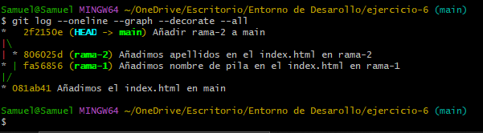

12. Realiza un cambio en la rama main  para avanzar un commit más

    ```bash 
    nano index.html
    ```

    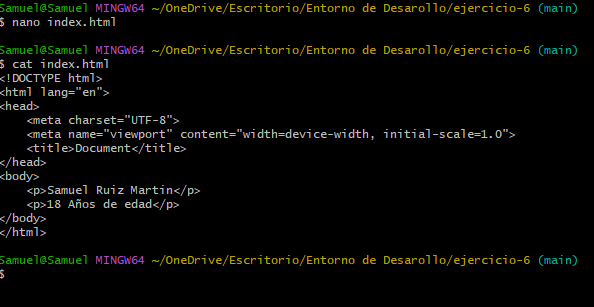

    ```bash
    git -am "añadimos la edad en main"
    git log
    ```

    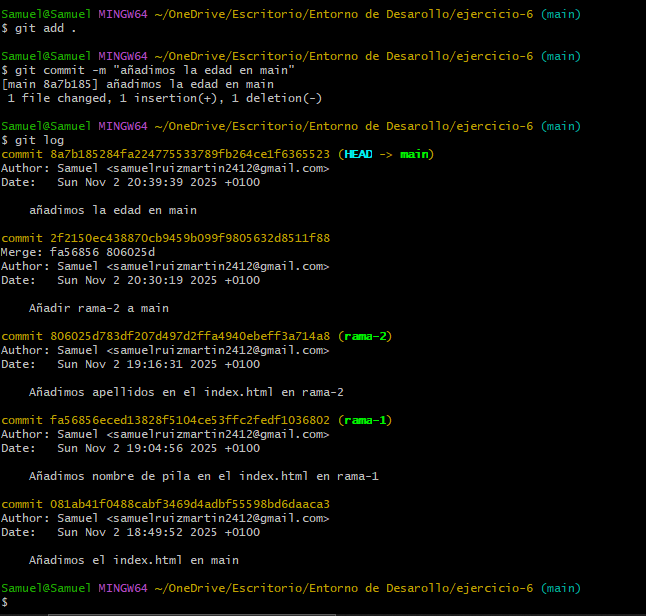

13. Elimina las ramas correctamente fusionadas (sin asterisco) para quedarte SOLO con la rama main.

    ```bash
    git branch -d rama-1
    git branch -d rama-2
    ```

    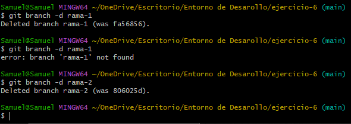

    Mostramos las ramas

    ```bash
    git branch 
    ```
    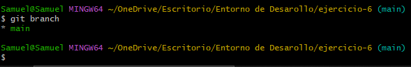


## Segunda parte

Sobre el repositorio de la unidad crea un fichero .gitignore para ignorar:

- Fichero tipo .doc

- Un directorio llamado _prueba_

    ```bash
    # Ignora los ficheros .doc

    *.doc

    # ignora la carpeta prueba

    prueba/
    ```

    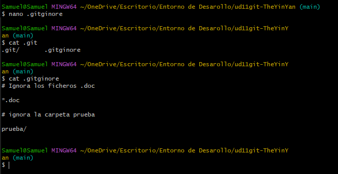
    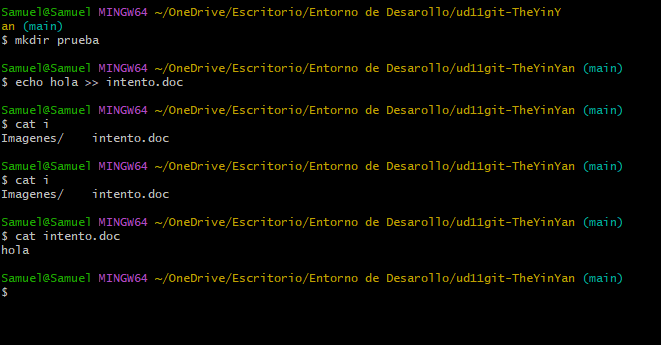
    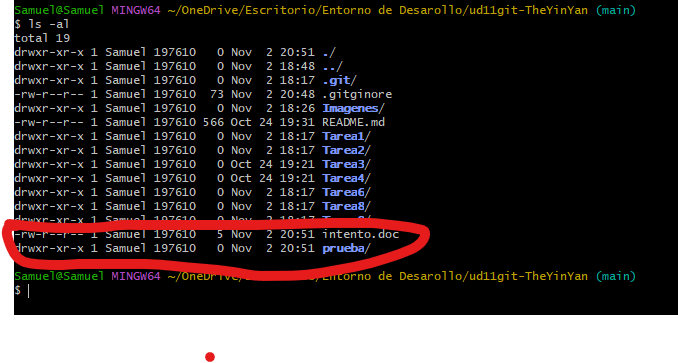
    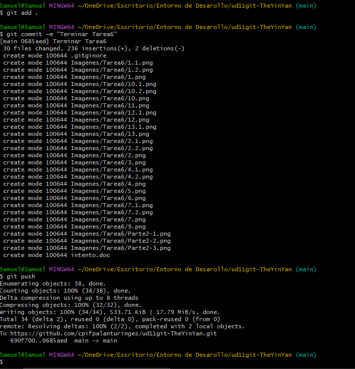

[Readme Principal](../../Readme.md) <br>
[Readme T1.1](../README.md)