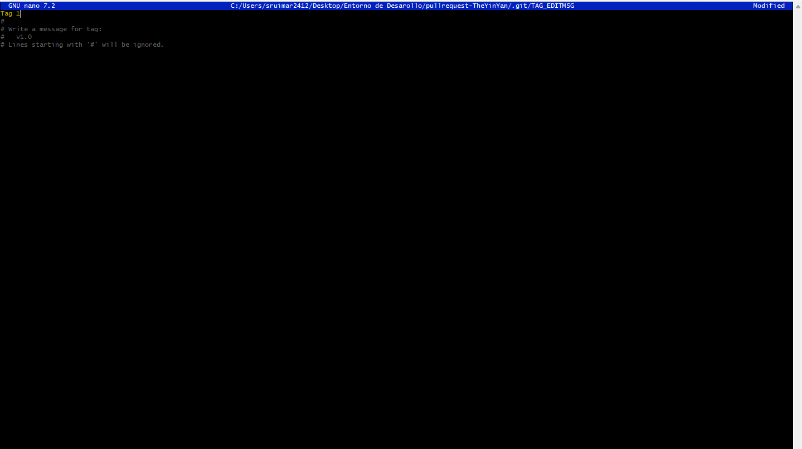
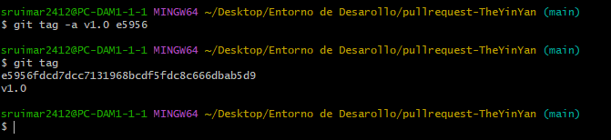
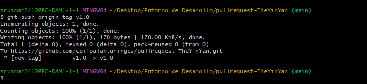
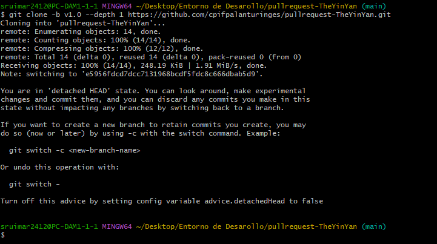

# Generación de un conflicto en git y fichero .gitignore

[Readme Principal](/README.md) <br>
[Readme T1.1](../README.md)

## Por parejas.

1.  Realicemos un fork del repositorio

    

2.  Clona el repositorio

    

    Abre la terminal y ejecuta el siguiente comando. Esto clonará el repositorio localmente.

    ```bash
    git clone [DIRECCIÓN HTTPS]
    ```

    Debemos ir al repositorio clonado ejecutando el siguiente comando:

    ```bash
    cd [NOMBRE DEL REPOSITORIO]
    ```

3.  Crea una rama

    Ahora crea una rama usando el comando _git checkout_

    ```bash
    git checkout -b [Nombre de la Rama]
    ```

    

4.  Realiza cambios y confírmalos

    Has cambios esenciales al proyecto y guárdalos. <br>
    Luego ejecuta _git status_ , y verás los cambios.

    

    Agrega esos cambios a la rama recién creada usando el comando git add:

    ```bash
	git add .
    ```

    Ahora confirma esos cambios utilizando el comando git commit:

    ```bash
    git commit -m "Adding an article to week 02 of articles of the week"
    ```

    

5.  Envía los cambios a GitHub

    Para enviar los cambios a GitHub, debemos identificar el nombre del repositorio remoto.

    ```bash
    git remote
    ```

    Luego de identificar el nombre podemos enviar en forma segura los cambios a GitHub.

    ```bash
    git push origin [Nombre de la Rama]
    ```

6.  Crea un pull request

    Ve a tu repositorio en GitHub y verás un botón llamado "Pull request", has clic en él.

    

7.  Aceptar un push

    
    

## Individual

1.  Creacion del Tag

    ```bash
    git tag e5956fdcd7dcc7131968bcdf5fdc8c666dbab5d9
    ```

    

2.  Iniciamos el Tag

    ```bash
    git tag -a v1.0 e5956
    git tag
    ```

    

3.  Enviamos Push al Tag a origen

    ```bash
    git push origin tag v1.0
    ```

    

4.  Clonamos el Tag

    ```bash
    git clone -b v1.0 --depth 1 https://github.com/cpifpalanturinges/pullrequest-TheYinYan.git
    ``` 

    

[Readme Principal](/README.md) <br>
[Readme T1.1](../README.md)
