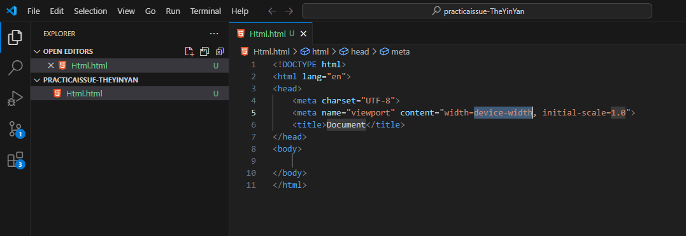
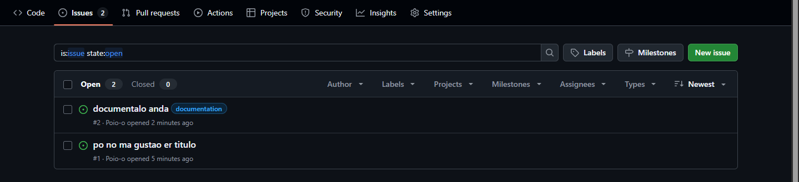
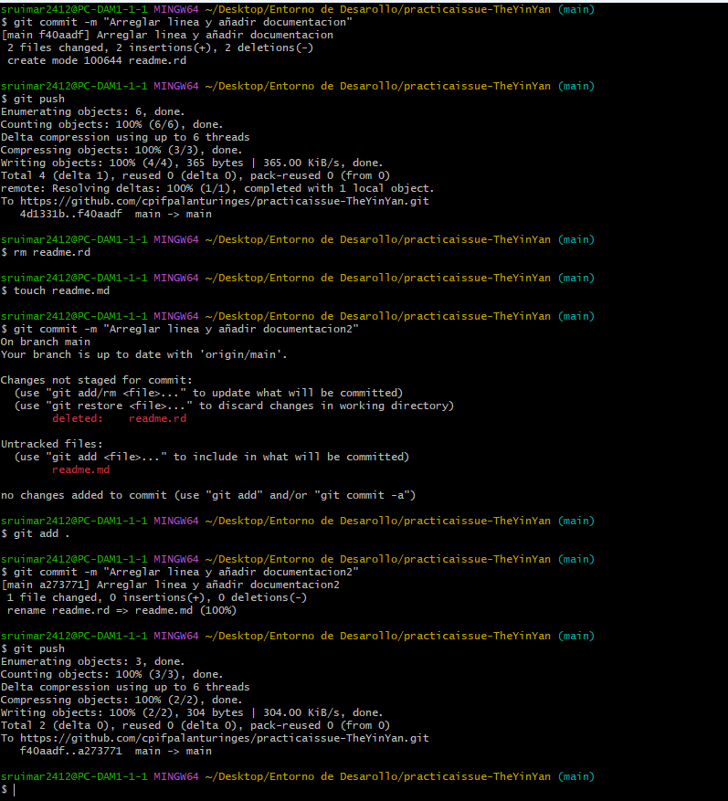
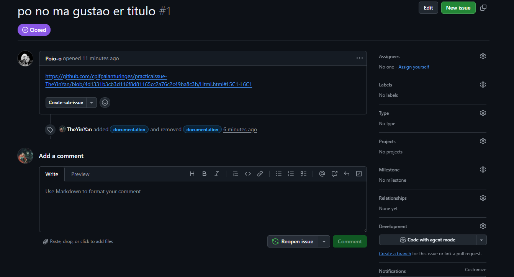
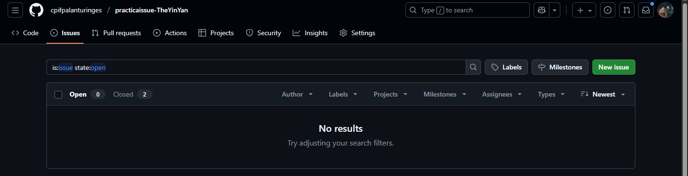

# GitHub issues (por parejas)

[Readme Principal](/README.md)  
[Readme T1.1](../README.md)

1. Creamos el HTML

    

2. Creamos un issues

    

3. Creamos otro y etiquetmos con lo etiqueta documentación 

    

4. Subimos  la correciones 

    

5. Cerramos el issues

    
    

[Readme Principal](/README.md)  
[Readme T1.1](../README.md)