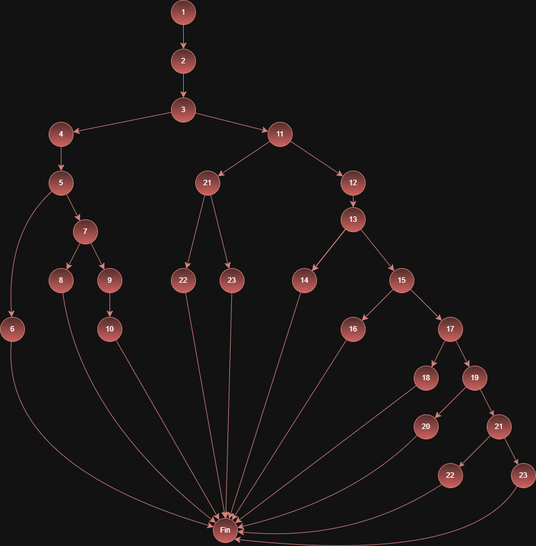

# Tarea 2: Codigo 1 Definición Pruebas
[Readme Principal](/README.md)  
[Readme T3](../README.md)  
[Codigo del Programa en Java](codigo/MenuVideojuego.java)

## Grafo de Flujo del metodo 

### Nodos

1. Inicio
2. Lectura datos
3. if personaje == 1
4. Elección Guerrero
5. if accion == 1
6. Guerrero ataca
7. else if accion == 2
8. Guerrero se defiende
9. else 
10. Guerrero busca objeto
11. else if personaje == 2
12. Elección Mago
13. if accion == 1 && esDeDia
14. Mago lanza una bola de fuego
15. else if accion == 1 && !esDeDia
16. Mago lanza hechizo de sombras
17. else if accion == 2
18. Mago se defiende
19. else 
20. Mago bebe una poción
21. else if personaje == 3
22. Elección arquero y ataque 
23. Personaje no válido
24. Fin

### Digrama Flujo Imagen

## Complejidad ciclomática

La Formmula de Complejidad ciclomática es:

**V(G) = Número de puntos de decisión + 1**

- **V(G)** es Complejidad ciclomática
- **Número de puntos de decisión** es el número de puntos de decisión ***(if, else if, bucles, operadores lógicos)***

### Ahora aplicamos la formula
En este caso es **Número de puntos de decisión** es 10 

**V(G) = 10 + 1** 

**V(G) = 11**

La ***Complejidad ciclomática*** es de *11*

### Clasificación y Rangos de Complejidad Ciclomática

- **1 - 10 (Código Simple):** Código claro, con bajo riesgo y fácil de mantener.
- **11 - 20 (Complejidad Moderada):** Riesgo moderado; requiere pruebas más intensas y revisión para simplificar.
- **21 - 50 (Alta Complejidad):** Código de alto riesgo, difícil de probar y mantener.
- **> 50 (Muy Alta Complejidad):** Código inmanejable, no testeable y crítico. Requiere refactorización inmediata.

### Conclusión

***Complejidad ciclomática*** = 11

- Esta en el rango de 11 - 20

- Código es de *Complejidad Moderada*

Le recomendaria al compañero que intentara refactorizar alguans funcines para que cumpla el estandar de la empresa

## Conjunto básico de caminos independientes. 

<!-- Guerrero -->
1.  personaje == 1,  accion == 1 
2.  personaje == 1,  accion == 2 
3.  personaje == 1,  accion == 3

<!-- Mago -->
4.  personaje == 2,  accion == 1, esDeDia = true
5.  personaje == 2,  accion == 1, esDeDia = false
6.  personaje == 2,  accion == 2 
7.  personaje == 2,  accion == 3

<!-- Arquero -->
8. personaje == 3

<!-- Personaje no valido -->
9. personaje > 3 
10. personaje < 1

##  Casos de prueba. 

| **Caso Prueba** | **Camino** | **personaje** | **accion** | **esDeDia** | **Resultado Esperado**         | **Estado** |   
|-----------------|------------|---------------|------------|-------------|--------------------------------|------------|
|      CP01       |     C01    |       1       |      1     |     false   |  Guerrero ataca                |     Ok     | 
|      CP02       |     C02    |       1       |      2     |     false   |  Guerrero se defiende          |     Ok     | 
|      CP03       |     C03    |       1       |      3     | ***false*** |  Guerrero busca objeto         |     Ok     | 
|      CP04       |     C04    |       2       |      1     | ***true***  |  Mago lanza una bola de fuego  |     Ok     | 
|      CP05       |     C05    |       2       |      1     |     false   |  Mago lanza hechizo de sombras |     Ok     | 
|      CP06       |     C06    |       2       |      2     |     false   |  Mago se defiende              |     Ok     | 
|      CP07       |     C07    |       2       |      3     |     false   |  Mago bebe una poción          |     Ok     | 
|      CP08       |     C08    |       3       |      1     |     false   |  Elección arquero y ataque     |     Ok     | 
|      CP09       |     C09    |       5       |      1     |     false   |  Personaje no válido           |     Ok     | 
|      CP010      |     C010   |       -1      |      1     |     false   |  Personaje no válido           |     Ok     | 

En los caso ***CP03*** y ***CP04*** varia **esDeDia** ya que son los únicos caminos que requieren dicha comprobación.

## Particiones de equivalencia (Incluye valores límite)

**Personaje:**

-  **Validos:** {1,2,3}
- **Invalidos:** {Menores de 1 y Mayores de 3}
- **Minimo Valido:** 1
- ***Maximo Valido:** 3

**Accion:**

-  **Validos:** {1,2,3}
- **Invalidos:** {Menores de 1 y Mayores de 3}
- **Minimo Valido:** 1
- ***Maximo Valido:** 3

**esDeDia:**

- **Validos:** true o false
- **Invalidos:** cualquer cosa que no sea true o false

[Readme Principal](/README.md)  
[Readme T3](../README.md)