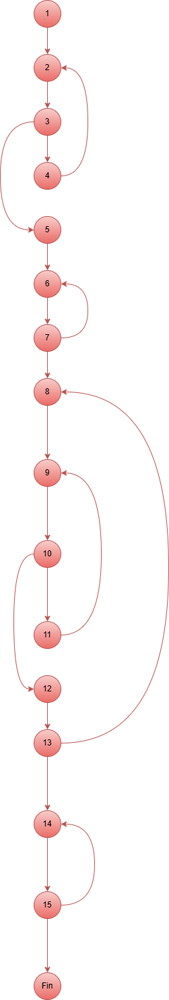

# Tarea 3: Codigo 2 Definición Pruebas
[Readme Tema 3](../Readme.md)  
[Readme Principal](../../Readme.md)  
[Codigo del Programa en Java](codigo/ModificarArraySimple.java)

## Grafo de Flujo del metodo 

### Nodos

1. Inicio
2. while (true)
3. if tamano > 0 && posicion <= tamano
4. Error: esa posición no existe.
5. Creamos un array de enteros con el tamaño proprocionado anteriormente.
6. for (int i = 0; i < tamano; i++)
7. Rellenar array
8. while (true)
9. while (true)
10. if (posicion > 0 && posicion <= tamano)
11. Error: esa posición no existe.
12. Pedimos el nuevo valor.
13. if (respuesta.equalsIgnoreCase("n"))
14. for (int i = 0; i < tamano; i++)
15. Imprimir Array
16. Fin

### Digrama Flujo Imagen

## Complejidad ciclomática

La Formmula de Complejidad ciclomática es:

**V(G) = Número de puntos de decisión + 1**

- **V(G)** es Complejidad ciclomática
- **Número de puntos de decisión** es el número de puntos de decisión ***(if, else if, bucles, operadores lógicos)***

### Ahora aplicamos la formula
En este caso es **Número de puntos de decisión** es 8 

**V(G) = 8 + 1** 

**V(G) = 9**

La ***Complejidad ciclomática*** es de *9*

### Clasificación y Rangos de Complejidad Ciclomática

- **1 - 10 (Código Simple):** Código claro, con bajo riesgo y fácil de mantener.
- **11 - 20 (Complejidad Moderada):** Riesgo moderado; requiere pruebas más intensas y revisión para simplificar.
- **21 - 50 (Alta Complejidad):** Código de alto riesgo, difícil de probar y mantener.
- **> 50 (Muy Alta Complejidad):** Código inmanejable, no testeable y crítico. Requiere refactorización inmediata.

### Conclusión

***Complejidad ciclomática*** = 9

- Esta en el rango de 1 - 10

- Código es Código Simple*

No le tengo que decir nada al compañero ya que la complejidad estaen el rango que hacepta la empresa.

## Conjunto básico de caminos independientes. 

##  Casos de prueba. 

tamano = t, posicion = p, valor = v y respuesta = r

| **Caso Prueba** | **Camino** |                 **Datos de entrada**                   |   **Resultado Esperado** | **Estado** |   
|-----------------|------------|--------------------------------------------------------|------------------------|------------|
|      CP01       |     C01    | t=3, p=1, v=1, r=n (sin modificar)                     | Array [0,1,2]          |     Ok     | 
|      CP02       |     C02    | t=0 luego t=2, p=2, v=99, r=n                          | Array [0,99]           |     Ok     | 
|      CP03       |     C03    | t=3, p=5 (inválido) luego p=1, v=50, r=n               | Array [50,1,2]         |     Ok     | 
|      CP04       |     C04    | t=4, p=1 v=10,r=s, p=3 v=30, r=n                       | Array [10,1,30,3]      |     Ok     |  
|      CP05       |     C05    | t=3, p=2 v=20, r=s, p=5 inválido luego p=3 v=33, r=n   | Array [0,20,33]        |     Ok     | 
|      CP06       |     C06    | t=6 p=0 (invalido) p=1 v=-1, r=n                       | Array [11,22,33]       |     Ok     | 
|      CP07       |     C07    | t=2, p=0 inválido, p=-1 inválido, luego p=1 v=1, r=n   | Array [0,9]            |     Ok     | 
|      CP08       |     C08    | t=2, p=1 v=1 r=s, p=2 v=2 r=s, p=1 v=100 r=n           | Array [100,2]          |     Ok     | 
|      CP09       |     C09    | t=6, p=1, v=-1, r=s, p=6, v=-6, r=n                    | Array [-1,1,2,3,4,-6]  |     Ok     | 

## Particiones de equivalencia (Incluye valores límite)

**Tamano:**

- **Validos: Mayores de 0 Menores 1065000000** 
- **Invalidos: Menores de 1** 
- **Minimo Valido: 1** 
- ***Maximo Valido: 1065000000** 

**Posicion:**

- **Validos: Mayores que 0 y mnores que numero de tamaño** 
- **Invalidos: Menores de 1** 
- **Minimo Valido: 1** 
- ***Maximo Valido: numero de tamaño**

**Valor:**

- **Validos: Menores 1065000000** 
- **Invalidos: String** 
- **Minimo Valido: 1** 
- ***Maximo Valido: 1065000000**

**Respuesta:**

- **s**
- **n**

[Readme Tema 3](../Readme.md)  
[Readme Principal](../../Readme.md)  