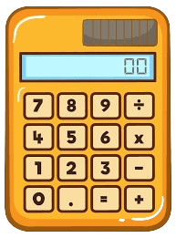

# Tarea 5: Pruebas unitarias con JUnit. Calculadora
[Readme Tema 3](../Readme.md) 
[Readme Principal](../../Readme.md)  

[Main calculadora](codigo/src/main/java/com/eed/calculadora/Calculadora.java)

[Test Calculadora](codigo/src/test/java/com/eed/calculadora/CalculadoraTest.java)

Todos los casos cubiertos

[Readme Tema 3](../Readme.md)  
[Readme Principal](../../Readme.md)  