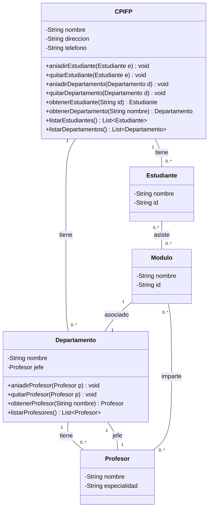

# Práctica 1: Trazado de diagrama de clases a partir de especificaciones

[Readme Principal](../README.md)

## Descripción de la práctica

Modela en un diagrama de clases el sistema de información de un CPIFP como el nuestro. Cada CPIFP tiene un nombre, dirección y teléfono. A ellos podremos añadir y quitar estudiantes o departamentos y son usuales las situaciones en las que se necesitará obtener un estudiante o departamento concreto u obtener un listado con todos los estudiantes o departamentos.

Los estudiantes tendrán un nombre y un identificador, pertenecerán a un único CPIFP y podrán asistir a cero o más módulos. Los profesores tendrán un nombre y una especialidad y podrán impartir uno o más módulos. Un módulo tendrá un nombre, un identificador y estará asociado con un único departamento, cero o más alumnos y cero o más profesores.

Un profesor pertenecerá a un único departamento. Los departamentos tendrán un nombre, uno o más profesores y un único jefe/a de departamento. En los departamentos podremos añadir y quitar profesores, así como obtener los datos de uno en particular o la lista de todos ellos. Un departamento pertenecerá a un único CPIFP (que a su vez podrá tener uno o más departamentos).

## Diagrama de clases

[Readme Principal](../README.md)